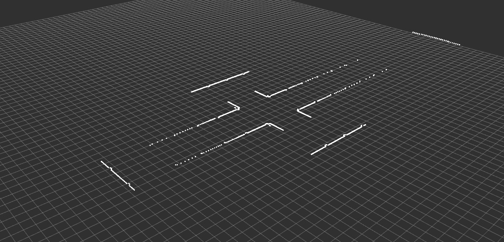

## Lidar 2D Topic

### Objective: Ensure that Lidar 2D Component is correctly publishing a LaserScan topic
### Prerequisites:

- O3DE Editor is running and the scene is already opened.
- ROS2 Gem is enabled for the project
- A scene has been created in the O3DE Editor.
- A robot prefab has been imported into the scene and it already has a Lidar component added to it.
- ROS2 environment is sourced (`source /opt/ros/humble/setup.bash`)

### Test Steps:

1. In the O3DE Editor, switch to the Game mode by clicking the Play button on the top toolbar.
2. In the terminal window, run the command `ros2 topic list` to verify that the `/lidar_2d/scan` topic is available.
3. Run command `ros2 topic echo /lidar_2d/scan` and verify the incoming message.
4. Launch `rviz2` by running the following command in the terminal: `rviz2 laser_config.rviz`.
5. In the O3DE Editor, move the robot in the Game Mode around the scene to verify that the Lidar data is being published to the `/lidar_2d/scan` topic and visualized in `rviz2`. Data points shall be visible like in the image below: 

### Expected Result:

The Lidar data should be successfully published to the `/lidar_2d/scan` topic and visualized in `rviz2` when the robot prefab is moved around the scene in Game mode. The topic is publishing `LaserScan` messages: https://github.com/ros2/common_interfaces/blob/humble/sensor_msgs/msg/LaserScan.msg
> Note: Intensities are not currently supported