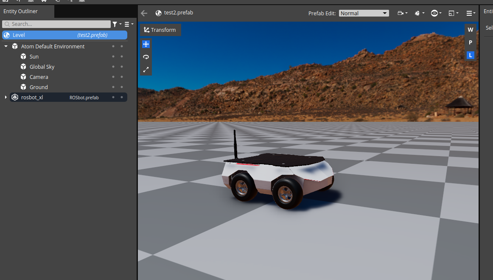
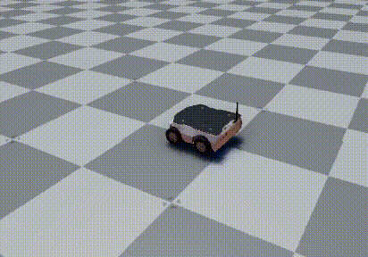

# Test Goal

- Check if ROS2 Control creates proper topics
- Check if messages are received and processed

# Test Perquisite

- Empty default Level
- ROS2 Gem activated
- RosRobotSample Gem activated 
- O3DE Editor running

# Steps

## Step 1

Launch the system terminal and run:

```bash
source /opt/ros/humble/setup.bash
ros2 topic list -t
```

Leave the terminal open - it will be needed in the next steps.

> Note: make sure, no ROS services are runing on your computer

### Expected result

- It should NOT include any messages of type: `geometry_msgs/msg/Twist`
- It should NOT include any messages of type: `ackermann_msgs/msg/AckermannDrive`

## Step 2 

Instantiate `ROSbot.prefab` from the `RosRobotSample` Gem. Move the robot to be located above the ground plane.

> TODO: change the ROSbot to something that does not relay on additional gem.

### Expected result

Your level should look like this:


## Step 3

Press `Ctrl+G` to enter game mode.

## Step 4 

In the terminal run:

```bash
ros2 topic list -t
```

### Expected result

You should see something like this:

```bash
/clock [rosgraph_msgs/msg/Clock]
/cmd_vel [geometry_msgs/msg/Twist]
/parameter_events [rcl_interfaces/msg/ParameterEvent]
/rosout [rcl_interfaces/msg/Log]
/tf [tf2_msgs/msg/TFMessage]
/tf_static [tf2_msgs/msg/TFMessage]
```

Detailed list of topics may by different, but:
- It should include `/cmd_vel` of type: `geometry_msgs/msg/Twist`
- It should NOT include any messages of type: `ackermann_msgs/msg/AckermannDrive`

## Step 5

In the terminal run:

```bash
ros2 topic pub -r 10 /cmd_vel geometry_msgs/msg/Twist "{linear: {x: 0.5, y: 0.0, z: 0.0}, angular: {x: 0.0, y: 0.0, z: 1.0}}"
```

### Expected result

The robot should drive in circles.


