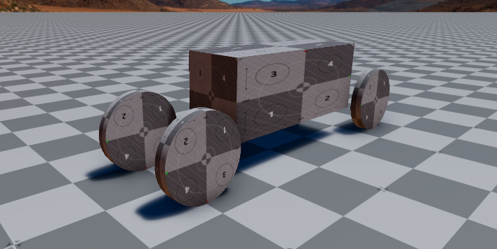

# Test Goal

- Check if ROS2 `geometry_msgs/msg/Twist` messages are properly interpreted by the skid steering vehicle model

# Test Perquisite

- ROS2 Gem activated
- O3DE Editor running

# Steps

## Step 1

Copy the file: [ackermann_robot.prefab](../Assets/ackermann_robot.prefab) into the Assets folder of your project and instantiate it. Move the robot to be located above the ground plane.

### Expected result

Your level should look like this:


## Step 2

Press `Ctrl+G` to enter game mode.

## Step 3

In the terminal run:

```bash
source /opt/ros/humble/setup.bash
ros2 topic pub -r 10 /base_link/ackermann_vel ackermann_msgs/msg/AckermannDrive "{steering_angle: 0.0, steering_angle_velocity: 0.0, speed: 0.0, acceleration: 0.0, jerk: 0.0}"
```

Leave the terminal open - it will be needed in the next steps.

### Expected result

The robot should not move.

## Step 4

In the terminal:

Press `Ctrl+C` to cancel the previous command and run:

```bash
ros2 topic pub -r 10 /base_link/ackermann_vel ackermann_msgs/msg/AckermannDrive "{steering_angle: 0.0, steering_angle_velocity: 0.0, speed: 2.0, acceleration: 0.0, jerk: 0.0}"
```

### Expected result

The robot should start moving forward in a straight line.

## Step 5

In the terminal:

Press `Ctrl+C` to cancel the previous command and run:

```bash
ros2 topic pub -r 10 /base_link/ackermann_vel ackermann_msgs/msg/AckermannDrive "{steering_angle: 0.0, steering_angle_velocity: 0.0, speed: -2.0, acceleration: 0.0, jerk: 0.0}"
```

### Expected result

The robot should start moving backward in a straight line.

## Step 6

In the terminal:

Press `Ctrl+C` to cancel the previous command and run:

```bash
ros2 topic pub -r 10 /base_link/ackermann_vel ackermann_msgs/msg/AckermannDrive "{steering_angle: 0.7, steering_angle_velocity: 0.0, speed: 2.0, acceleration: 0.0, jerk: 0.0}"
```

### Expected result

The robot should drive forward rotating in a counter-clockwise direction. Both frontal wheels should be twisted.

## Step 7

In the terminal:

Press `Ctrl+C` to cancel the previous command and run:

```bash
ros2 topic pub -r 10 /base_link/ackermann_vel ackermann_msgs/msg/AckermannDrive "{steering_angle: -0.7, steering_angle_velocity: 0.0, speed: 2.0, acceleration: 0.0, jerk: 0.0}"
```

### Expected result

The robot should drive forward rotating in a clockwise direction. Both frontal wheels should be twisted.

