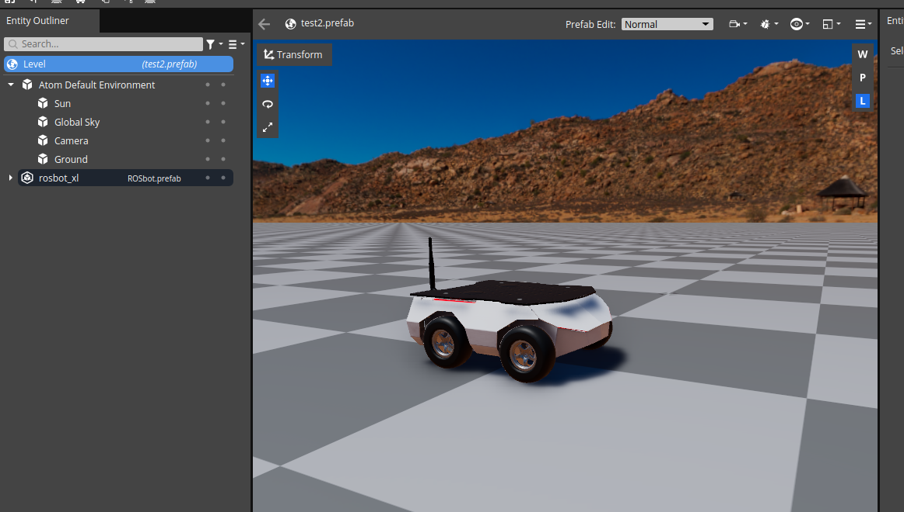

# Test Goal

- Check if ROS2 `geometry_msgs/msg/Twist` messages are properly interpreted by the skid steering vehicle model

# Test Perquisite

- Empty default Level
- ROS2 Gem activated
- RosRobotSample Gem activated 
- O3DE Editor running
- Physx 5 enabled

# Steps

## Step 1


Copy the file: [rosbot_xl_articulations.prefab](../Assets/rosbot_xl_articulations.prefab) into the Assets folder of your project and instantiate it. Move the robot to be located above the ground plane.

> Note : currently robot mass is set to very large value, to mitigate some instabilities.
> TODO: change the ROSbot to something that does not relay on additional gem.

### Expected result

Your level should look like this:


## Step 2

Press `Ctrl+G` to enter game mode.

## Step 3

In the terminal run:

```bash
source /opt/ros/humble/setup.bash
ros2 topic pub -r 20 /cmd_vel geometry_msgs/msg/Twist "{linear: {x: 0.0, y: 0.0, z: 0.0}, angular: {x: 0.0, y: 0.0, z: 0.0}}"
```

Leave the terminal open - it will be needed in the next steps.

### Expected result

The robot should not move.

## Step 4

In the terminal:

Press `Ctrl+C` to cancel the previous command and run:

```bash
ros2 topic pub -r 10 /cmd_vel geometry_msgs/msg/Twist "{linear: {x: 0.5, y: 0.0, z: 0.0}, angular: {x: 0.0, y: 0.0, z: 0.0}}"
```

### Expected result

The robot should start moving forward in a straight line.

## Step 5

In the terminal:

Press `Ctrl+C` to cancel the previous command and run:

```bash
ros2 topic pub -r 10 /cmd_vel geometry_msgs/msg/Twist "{linear: {x: -0.5, y: 0.0, z: 0.0}, angular: {x: 0.0, y: 0.0, z: 0.0}}"
```

### Expected result

The robot should start moving backward in a straight line.

## Step 6

In the terminal:

Press `Ctrl+C` to cancel the previous command and run:

```bash
ros2 topic pub -r 10 /cmd_vel geometry_msgs/msg/Twist "{linear: {x: 0.0, y: 0.0, z: 0.0}, angular: {x: 0.0, y: 0.0, z: 0.5}}"
```

### Expected result

The robot should start rotating in place in a counter-clockwise direction.

## Step 7

In the terminal:

Press `Ctrl+C` to cancel the previous command and run:

```bash
ros2 topic pub -r 10 /cmd_vel geometry_msgs/msg/Twist "{linear: {x: 0.0, y: 0.0, z: 0.0}, angular: {x: 0.0, y: 0.0, z: -0.5}}"
```

### Expected result

The robot should start rotating in place in a clockwise direction.

## Step 8

In the terminal:

Press `Ctrl+C` to cancel the previous command and run:

```bash
ros2 topic pub -r 10 /cmd_vel geometry_msgs/msg/Twist "{linear: {x: 0.0, y: 2.0, z: 2.0}, angular: {x: 2.0, y: 2.0, z: 0.0}}"
```

### Expected result

The robot should not move.
