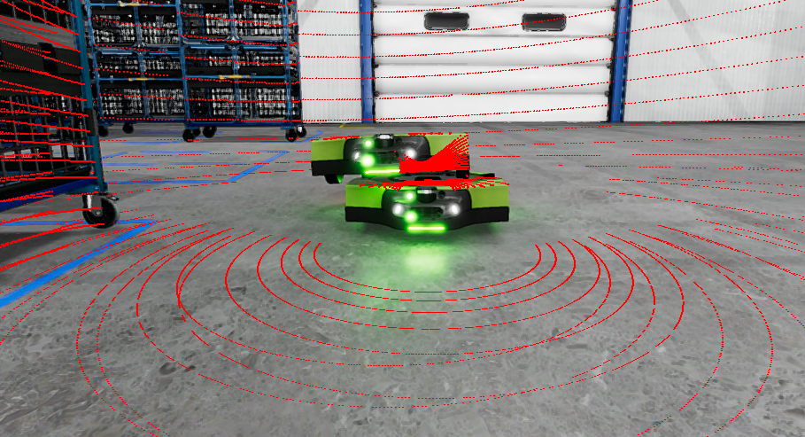

# Test Goal

- Check if robots are spawned correctly
- Check if proper topics are created

# Test Perquisite

- ROS2 Gem activated
- O3DE Editor running
- Warehouse scene opened
- Proteus Gem enabled in project

# Steps

## Step 1

Press `Ctrl+G` to enter game mode.

## Step 2

Launch the system terminal and run:

```bash
source /opt/ros/humble/setup.bash
ros2 topic list -t
```

Leave the terminal open - it will be needed in the next steps.

> Note: make sure, no ROS services are runing on your computer

### Expected result

- It should NOT include any messages of type: `proteus_1/...`, ` proteus_2/...`, etc.

## Step 3

In terminal run:
```bash
ros2 service call /spawn_entity gazebo_msgs/srv/SpawnEntity '{name: 'proteus', xml: 'spawnPoint1'}'
ros2 service call /spawn_entity gazebo_msgs/srv/SpawnEntity '{name: 'proteus', xml: 'spawnPoint1'}'
```

### Expected result



## Step 4 

In the terminal run:

```bash
ros2 topic list -t
```

### Expected result

You should see something like this:

```bash
/clock [rosgraph_msgs/msg/Clock]
/parameter_events [rcl_interfaces/msg/ParameterEvent]
/proteus_1/cmd_vel [geometry_msgs/msg/Twist]
/proteus_1/pc [sensor_msgs/msg/PointCloud2]
/proteus_2/cmd_vel [geometry_msgs/msg/Twist]
/proteus_2/pc [sensor_msgs/msg/PointCloud2]
/rosout [rcl_interfaces/msg/Log]
/tf [tf2_msgs/msg/TFMessage]
/tf_static [tf2_msgs/msg/TFMessage]
```

Detailed list of topics may by different, but:
- It should include `/proteus_1/cmd_vel`, ` /proteus_2/cmd_vel` of type: ` geometry_msgs/msg/Twist`
- It should include `/proteus_1/pc`, ` /proteus_2/pc` of type: ` sensor_msgs/msg/PointCloud2`
