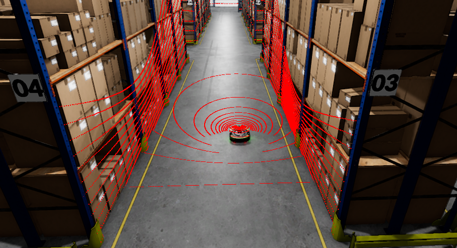

# Test Goal

- Check if robots are spawned correctly

# Test Perquisite

- ROS2 Gem activated
- O3DE Editor running
- Warehouse scene opened
- Proteus Gem enabled in project

# Steps

## Step 1

Press `Ctrl+G` to enter game mode.

## Step 2

Launch the system terminal and run:

```bash
source /opt/ros/humble/setup.bash
ros2 topic list | grep proteus | wc -l && ros2 service list | grep proteus | wc -l
```

Leave the terminal open - it will be needed in the next steps.

> Note: make sure, no ROS services are runing on your computer

### Expected result

```bash
0
0
```

## Step 3

In terminal run:
```bash
ros2 service call /spawn_entity gazebo_msgs/srv/SpawnEntity '{name: 'proteus', xml: 'spawnPoint100'}'
```

### Expected result
Commands were executed with success.


