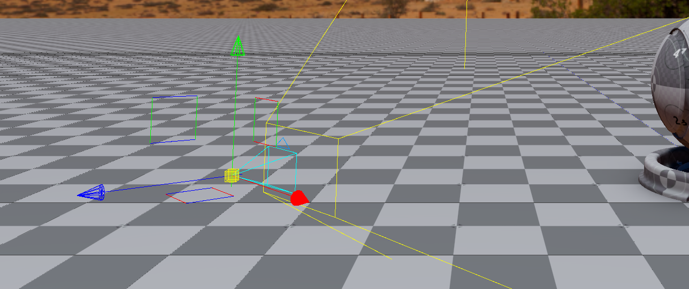
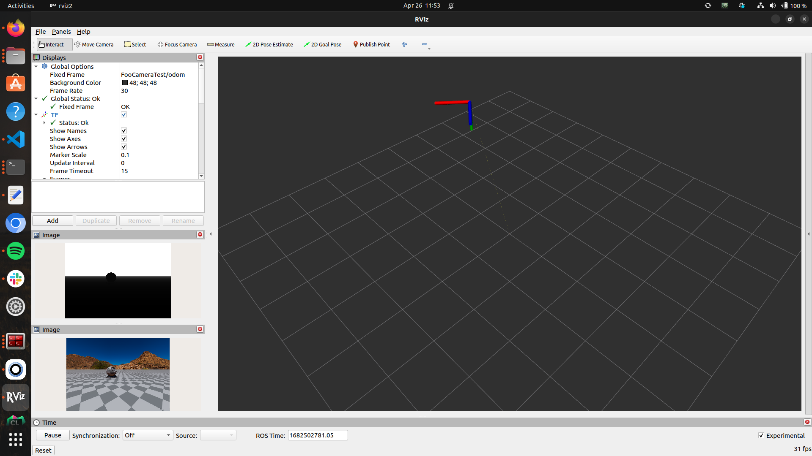

# Test Goal

 - Check if ROS2 Camera sensor creates and publishes data

# Test Perquisite

 - Empty default Level
 - ROS2 Gem Activated
 - O3DE Editor running

# Steps

## Step 1 

### 
Execute preparation script in o3de console:
```
pyRunFile Ros2CameraTest/01_CAMERA_TOPICS/tools/PrepareTestComponent.py
```

### Expected result 

- Script finishes, camera is created : 


- `FooCameraTest` enitity creates
- `FooCameraTest` has two activated components : `ROS2 Frame`, `ROS2 Camera Sensor`

### **Actual RESULT:**

```

```

## Step 2

Start Simulation with CTRL+G

### Expected result 

Simulation starts

### **Actual RESULT:**

```

```

## Step 3

- Start RVIZ2 and check data

```
rviz2 -d Ros2CameraTest/01_CAMERA_TOPICS/tools/rvizConfig.rviz
```

*Tweak rviz config, if data views loaded in incorrect places*

### Expected result 

- Both depth and RGB image visible
- Camera follows mouse movement


### **Actual RESULT:**

```

```