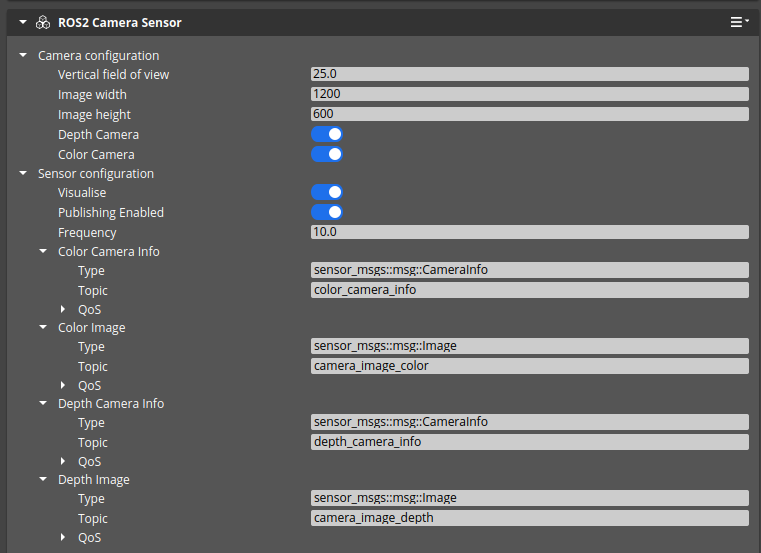

# Test Goal

 - Check if ROS2 Camera sensor is configurable

# Test Perquisite

 - Empty, default Level
 - ROS2 Gem Activated
 - O3DE Editor running

# Steps

## Step 1 

### 
Execute preparation script in o3de console:
```
pyRunFile Ros2CameraTest/02_CAMERA_CONFIGURATION_APPLIES/tools/PrepareTestComponent.py
```

### Expected result 

- Script finishes, camera is created : 

- `FooCameraTest` enitity creates
- `FooCameraTest` has two activated components : `ROS2 Frame`, `ROS2 Camera Sensor`
- `ROS2 Camera Sensor` has following configuration: 



### **Actual RESULT:**

```

```

## Step 2

Start Simulation with CTRL+G

### Expected result 

Simulation starts

### **Actual RESULT:**

```

```

## Step 3

Check if metadata follows configuration, resolution:

```
ros2 topic echo --once /FooCameraTest/color_camera_info | grep 'width: 1200' && \
ros2 topic echo --once /FooCameraTest/color_camera_info | grep 'height: 600' && \
ros2 topic echo --once /FooCameraTest/depth_camera_info | grep 'width: 1200' && \
ros2 topic echo --once /FooCameraTest/depth_camera_info | grep 'height: 600' 
```

### Expected result 
```
width: 1200
height: 600
width: 1200
height: 600
```

### **Actual RESULT:**

```

```
## Step 4

Check if metadata follows configuration, resolution:

```
ros2 topic echo --once /FooCameraTest/depth_camera_info | grep -A 10 -w 'p:' && \
ros2 topic echo --once /FooCameraTest/color_camera_info | grep -A 10 -w 'p:'

```

### Expected result 
```
p:
- 1353.2125440288344
- 0.0
- 600.0
- 0.0
- 0.0
- 1353.2125440288344
- 300.0
- 0.0
- 0.0
- 0.0
p:
- 1353.2125440288344
- 0.0
- 600.0
- 0.0
- 0.0
- 1353.2125440288344
- 300.0
- 0.0
- 0.0
- 0.0
```

**Small difference (0.1) is acceptable**

### **Actual RESULT:**

```

```


Step 4
Check if metadata follows configuration:


```
ros2 topic echo --once /FooCameraTest/camera_image_color | head -n 10 && \
ros2 topic echo --once /FooCameraTest/camera_image_depth | head -n 10
````

### Expected result 
```
header:
  stamp:
    sec: 985
    nanosec: 347119000
  frame_id: FooCameraTest/sensor_frame
height: 600
width: 1200
encoding: rgba8
is_bigendian: 0
step: 4800
header:
  stamp:
    sec: 986
    nanosec: 447186000
  frame_id: FooCameraTest/sensor_frame
height: 600
width: 1200
encoding: 32FC1
is_bigendian: 0
step: 4800
```
**Ignore stamp section when comparing**
### **Actual RESULT:**

```

```

