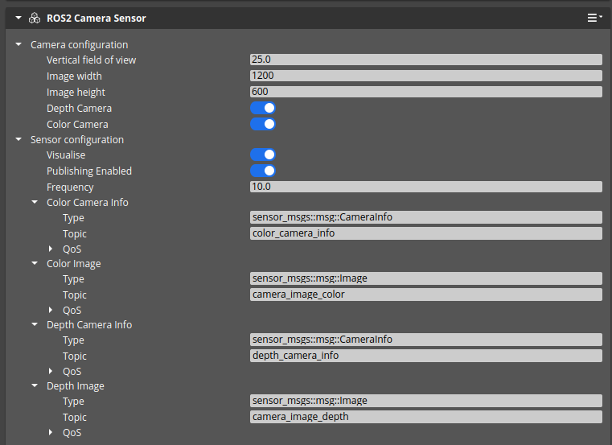

# Test Goal

 - Check if ROS2 Camera sensor is configuration is saved and loaded correctly.

# Test Perquisite

 - Empty, fresh default Level
 - ROS2 Gem Activated
 - O3DE Editor running

# Steps

## Step 1 

### 

Execute preparation script in o3de console:
```
pyRunFile Ros2CameraTest/CAMERA_CONFIGURATION_APPLIES/tools/PrepareTestComponent.py
```

### Expected result 

- Script finishes, camera is created : 

- `FooCameraTest` enitity creates
- `FooCameraTest` has two activated components : `ROS2 Frame`, `ROS2 Camera Sensor`
- `ROS2 Camera Sensor` has following configuration: 



### **Actual RESULT:**

```

```

## Step 2

Save level named "FooTestLevel" and close Editor

### Expected result 

No warnings

### **Actual RESULT:**

```

```

## Step 3


Open level named "FooTestLevel"

### Expected result 

No warnings

### **Actual RESULT:**

```

```
## Step 4

Verify if camera sensor has config loaded correctly

### Expected result :
- `FooCameraTest` enitity is available
- `FooCameraTest` has two activated components : `ROS2 Frame`, `ROS2 Camera Sensor`
- `ROS2 Camera Sensor` has following configuration: 


