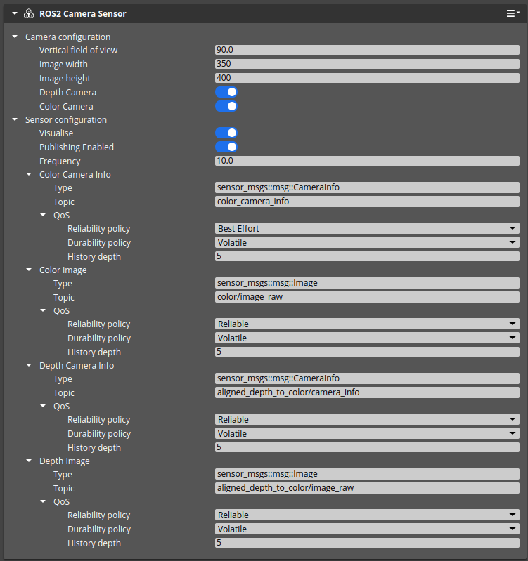
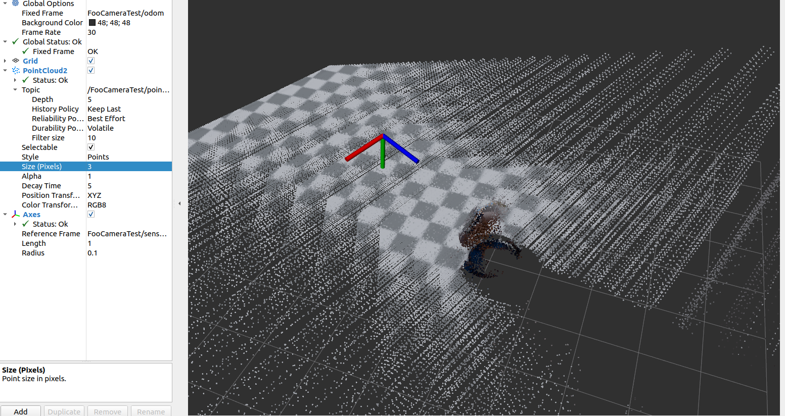

# Test Goal

 - Check if ROS2 Camera sensor is configuration is saved and loaded correctly.

# Test Perquisite

 - Empty, fresh default Level
 - ROS2 Gem Activated
 - O3DE Editor running

# Steps

## Step 1 

### 

Execute preparation script in o3de console:
```
pyRunFile Ros2CameraTest/04_CAMERA_RGBD_DATA_VALID/tools/PrepareTestComponent.py
```

### Expected result 

- Script finishes, camera is created : 

- `FooCameraTest` entity creates
- `FooCameraTest` has two activated components : `ROS2 Frame`, `ROS2 Camera Sensor`

### **Actual RESULT:**

```

```
## Step 3

Further adjusments to camera component:
| Paramter | Value |
|----------|------------|
|Color Image / Topic|`color/image_raw`|
|Depth Image / Topic|`aligned_depth_to_color/image_raw`|
|Depth Camera Info / Topic|`aligned_depth_to_color/camera_info`|
|Color Image / QoS / Reliability policy |`Reliable` |
|Depth Image / QoS / Reliability policy |`Reliable` |
|Depth Camera Info / QoS / Reliability policy |`Reliable` |

### Expected result 

No warnings, 



### **Actual RESULT:**

```

```
## Step 4

Start simulation with CTRL+G

### Expected result 
No warnings.
### **Actual RESULT:**

```

```

## Step 4

Load simple depth processing pipeline.
```
ros2 launch 'Ros2CameraTest/04_CAMERA_RGBD_DATA_VALID/tools/point_cloud_xyzrgb.launch.py' 
```
### Expected result 

Rviz should visualize pointcloud following mouse.


### **Actual RESULT:**

```

```


