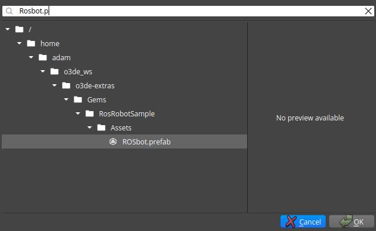
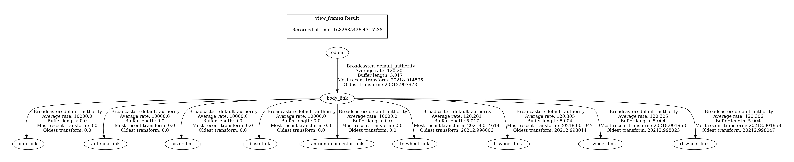

## Test Goal

Check if the prefab with defined tf tree is loaded correctly and the transforms are published.

## Test Perquisites

- Empty default Level
- ROS2 Gem Activated
- O3DE Editor running

## Steps

- Add the prefab to the level by right clicking on the level then `Instantiate Prefab` and select the prefab `ROSbot.prefab`

- Run the game (`ctrl + G`)

- Check the tf tree `ros2 run tf2_tools view_frames` This will create a file `*.pdf` in the current directory it should contain the following frames:

## Expected Result

The prefab is loaded and the tf tree is published.