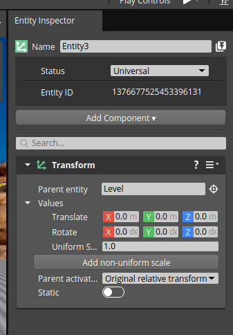
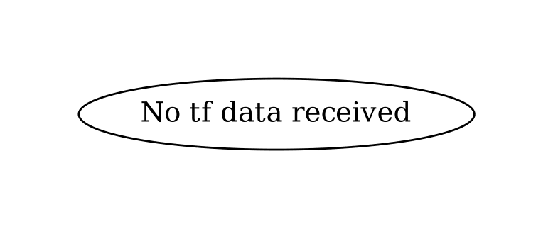
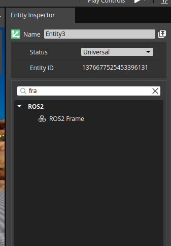
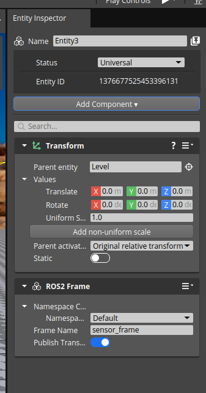
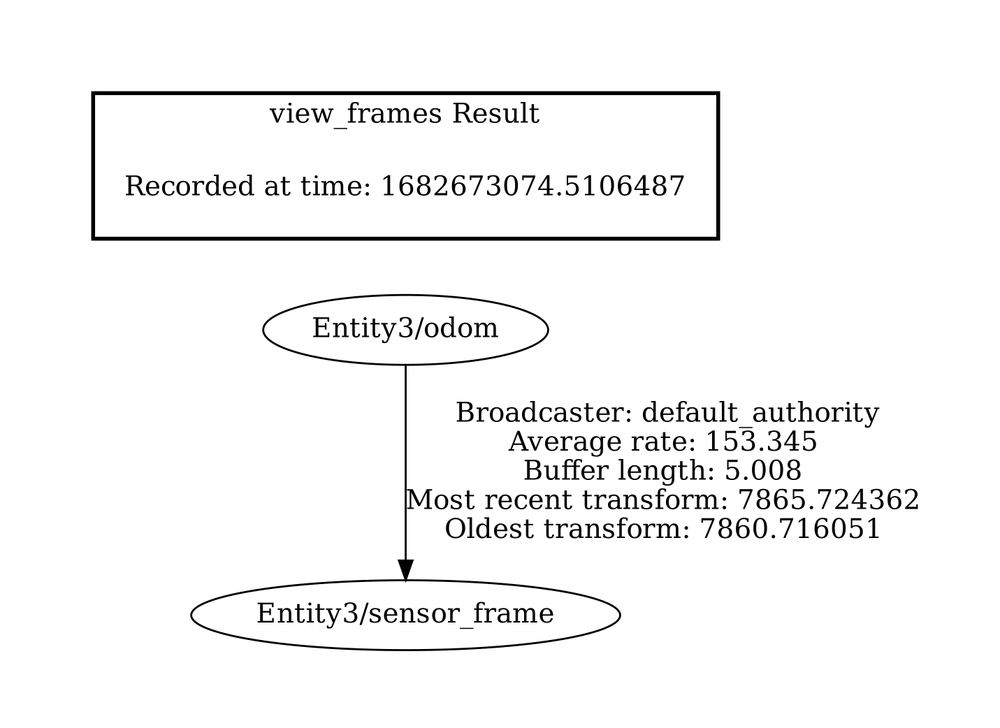

## Test Goal 

Check if the frame is added to the tf tree.

## Test Perquisites

- Empty default Level
- ROS2 Gem Activated
- O3DE Editor running

## Steps

1. Create entity

2. Check if there are no frames in the tf tree `ros2 run tf2_tools view_frames` This will create a file `*.pdf` in the current directory it should contain the following frames:

3. Add the frame component to the entity

4. The component should look like this:

5. Check if the frame is added to the tf tree `ros2 run tf2_tools view_frames` This will create a file `*.pdf` in the current directory it should contain the following frames:
 