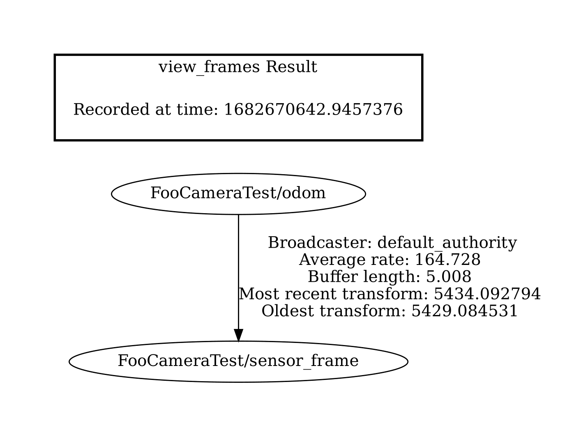

## Test Goal

Check when the frame is added to the tf tree the transform is published

## Test Perquisites

- Empty default Level
- ROS2 Gem Activated
- O3DE Editor running 

## Steps 

1. Execute preparation script in o3de console `pyRunFile Ros2FrameTest/frame_dynamic_transforms_published/tools/prepare_test.py`
2. Run the game (`ctrl + G`)
3. Check if the frame is added to the tf tree `ros2 run tf2_tools view_frames` This will create a file `*.pdf` in the current directory it should contain the following frames: 

4. Check if the transform is published `ros2 topic echo /tf` This should print the transform between the two frames. Move the camera (WASD) and check if the transform is updated.

## Expected Result

The frame is added to the tf tree and the transform is published
