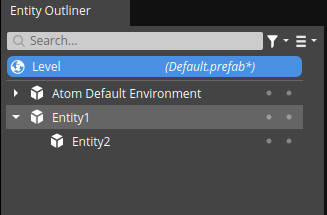
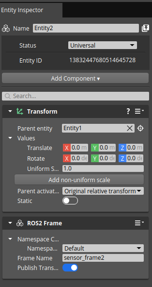
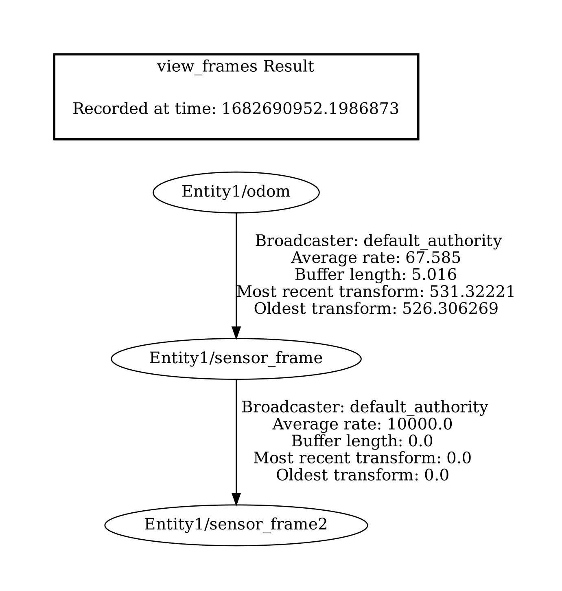

## Test Goal

Check when the frame is added to the tf tree the transform is published

## Test Perquisites

- Empty default Level
- ROS2 Gem Activated
- O3DE Editor running 

## Steps 

1. Create entity
2. Create second entity (child of the first entity)
3. Add the frame component to the both entities, the hierarchy should look like this:

3. Set the name to "sensor_frame2", should look like this:

4. Run the game (`ctrl + G`) 
5. Check if the frame is added to the tf tree `ros2 run tf2_tools view_frames` This will create a file `*.pdf` in the current directory it should contain the following frames:

