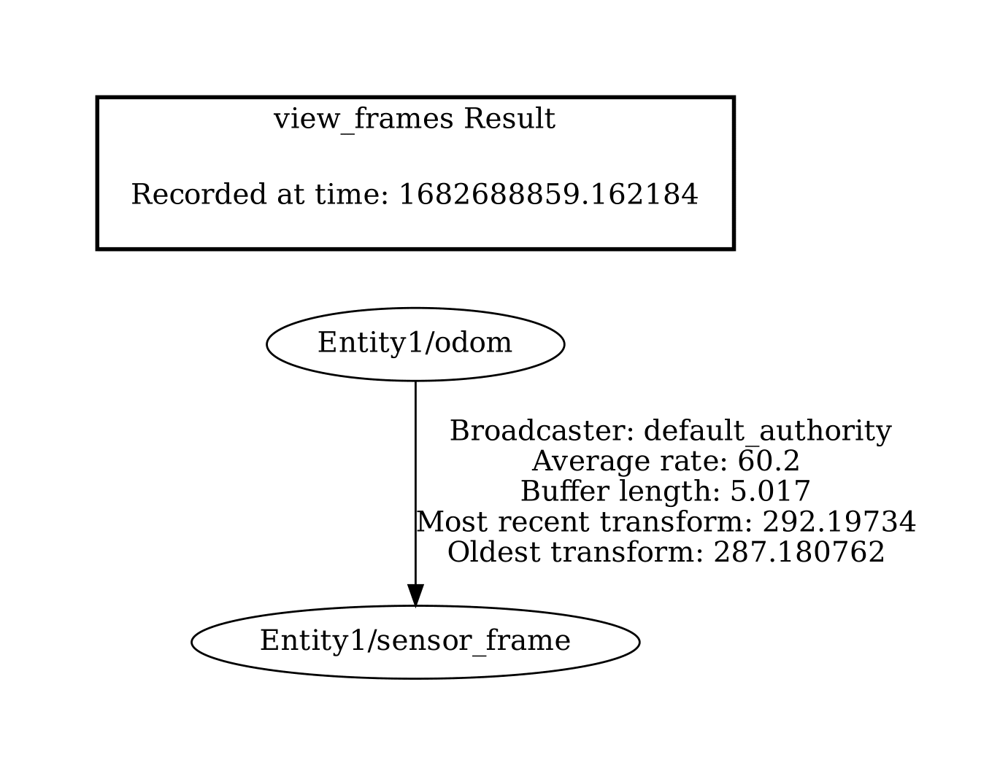
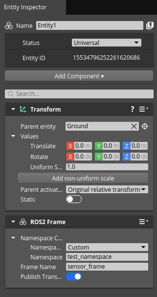
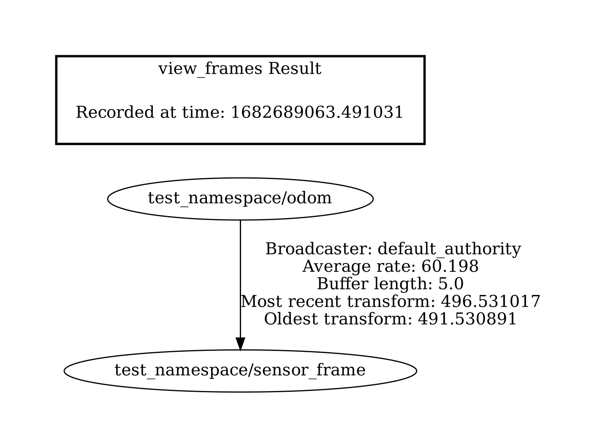

## Test Goal

Check if the changing of the namespace in the frame component is reflected in the tf tree.

## Test Perquisites

- Empty default Level
- ROS2 Gem Activated
- O3DE Editor running

## Steps

1. Create entity
2. Add the frame component to the entity the tf frames without changing the namespace.
3. Run the game (`ctrl + G`)
4. Check the frames by running `ros2 run tf2_tools view_frames`. The frame component should look like this:

1. Stop the game (`Esc Esc`) and add the namespace `test_namespace` to the frame component.

1. Run the game (`ctrl + G`)
2. Check the frames by running `ros2 run tf2_tools view_frames`. The frame component should look like this:
