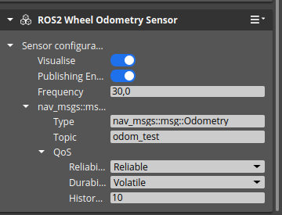

# Test Goal

- Check if ROS2 Odometry configuration is saved.

# Test Prequisite

- Empty default Level
- ROS2 Gem Activated
- O3DE Editor running

# Steps

## Step 1
 - Create new entity
```
pyRunFile /home/mateusz/o3de_ws/o3de-ros2-gem-testing/Ros2OdometryTest/tools/PrepareTestWheelOdometry.py
```

### Expected result

- Set ROS2 Odometry Sensor component parameters  


### **Actual RESULT:**

```

```

## Step 2
Start Simulation with CRTL+G

### Expected result
Simulation starts

### **Actual RESULT:**

```

```

### Step 3
- Verify that ROS2 Odometry sensor publishes data

```
ros2 topic echo --once --full-length /TestEntity/odom_test | grep "    "
```

### Expected result
```
    sec: 3833
    nanosec: 892293000
    position:
      x: 0.0
      y: 0.0
      z: 0.0
    orientation:
      x: 0.0
      y: 0.0
      z: 0.0
      w: 1.0
    linear:
      x: 0.0
      y: 0.0
      z: 0.0
    angular:
      x: 0.0
      y: 0.0
      z: 0.0
```
sec and nanosec do not matter.
### **Actual RESULT:**

```

```

## Step 4
- Stop Simulation with CRTL+G

### Expected result
Simulation stops

### **Actual RESULT:**

```

```

## Step 5
- Save level
### Expected result
Level saved
### **Actual RESULT:**

```

```
## Step 6
- Close Editor

## Step 7
- Open Editor
- Open saved level

### Expected result
Level opens
Configuration persist between sessions is the same as in Step 1  

### **Actual RESULT:**

```

```