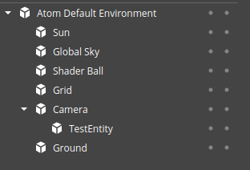
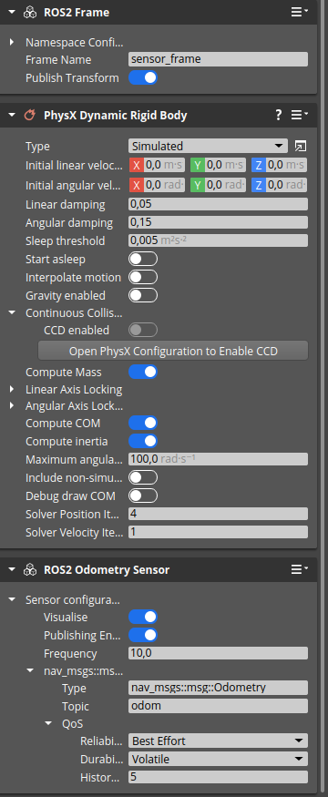

# Test Goal
    
- Check if ROS2 Odometry sensor creates and publishes data.

# Test Prequisite

- Empty default Level
- ROS2 Gem Activated
- O3DE Editor running

# Steps

## Step 1

### Create ROS2 Odometry sensor
- Create new entity
```
pyRunFile /home/mateusz/o3de_ws/o3de-ros2-gem-testing/Ros2OdometryTest/tools/PrepareTestOdometry.py
```

### Expected result



### **Actual RESULT:**

```

```

## Step 2
Start Simulation with CRTL+G

### Expected result
Simulation starts

### **Actual RESULT:**

```

```

## Step 3 

- Verify that ROS2 Odometry sensor publishes data

```
ros2 topic echo --once --full-length /Entity1/odom
```
### Expected result
Published data


### **Actual RESULT:**

```

```


## Step 4
