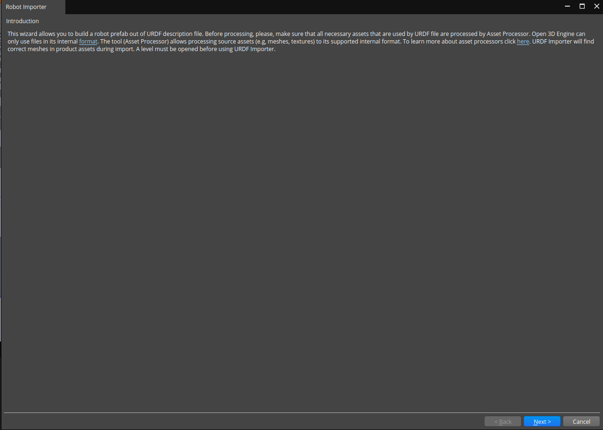
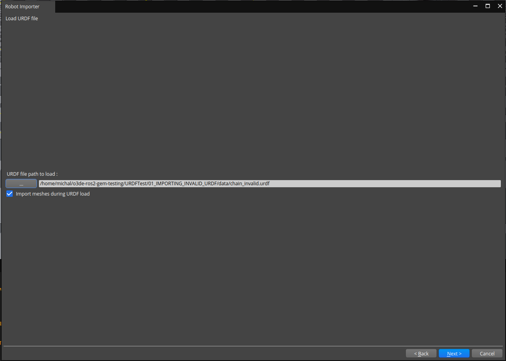
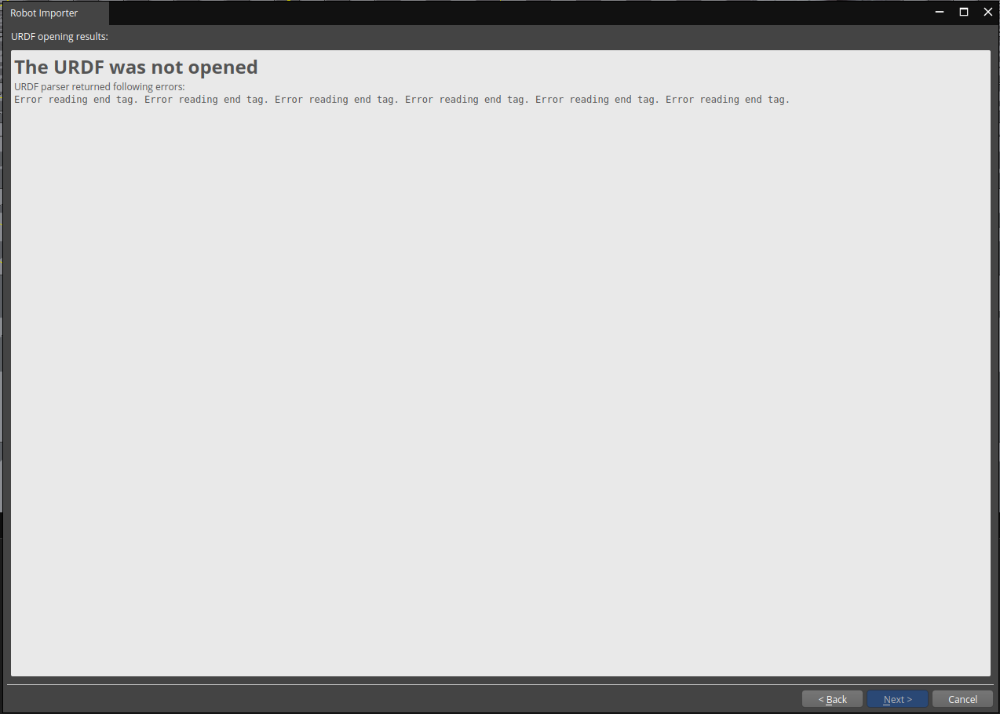

# Test Goal

 - Check if simple URDF with error is failing correctly

# Test Perquisite

 - Empty default Level
 - ROS2 Gem Activated
 - O3DE Editor running

# Steps

## Step 1 

Open URDF importer

### Expected result 

Windows appears



### **Actual RESULT:**

```

```

## Step 2

- Click next, choose file with "..." button.
- Navigate to attached `data` directory
- Pick `chain_invalid.urdf`
- Click `Open` 
- Click `Next`

### Expected result 
Wizard Page validate, next page was loaded.



### **Actual RESULT:**
```

```

## Step 3
The windows with output error should be displayed.
### Expected result 



### **Actual RESULT:**

```

```
