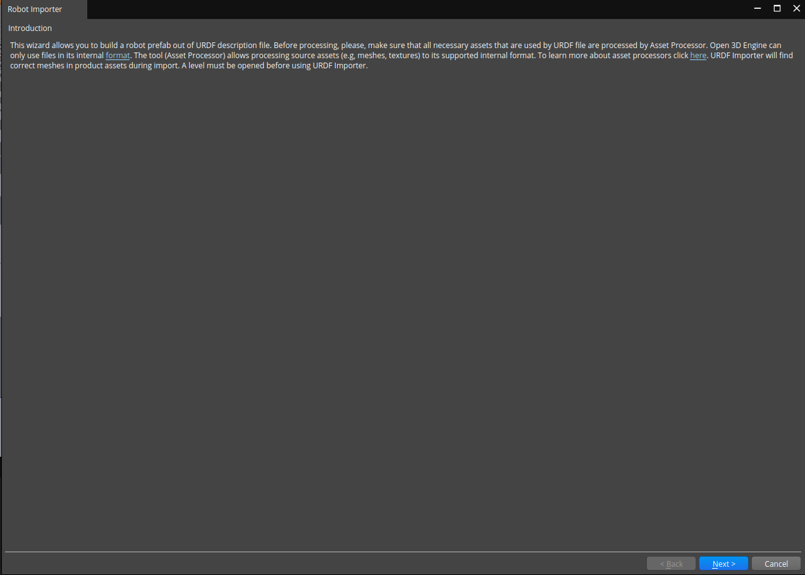
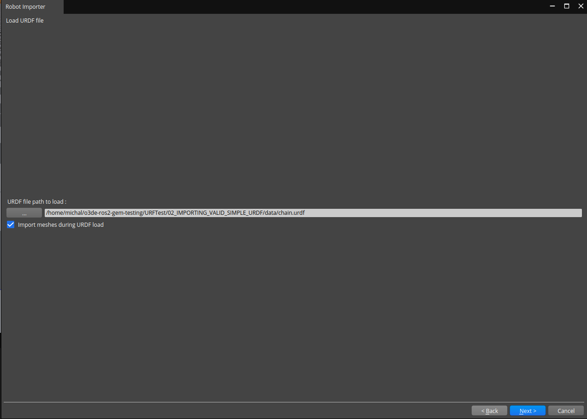
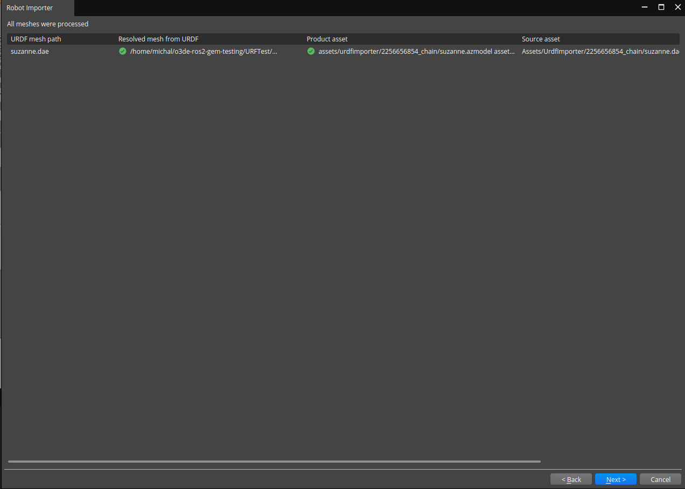
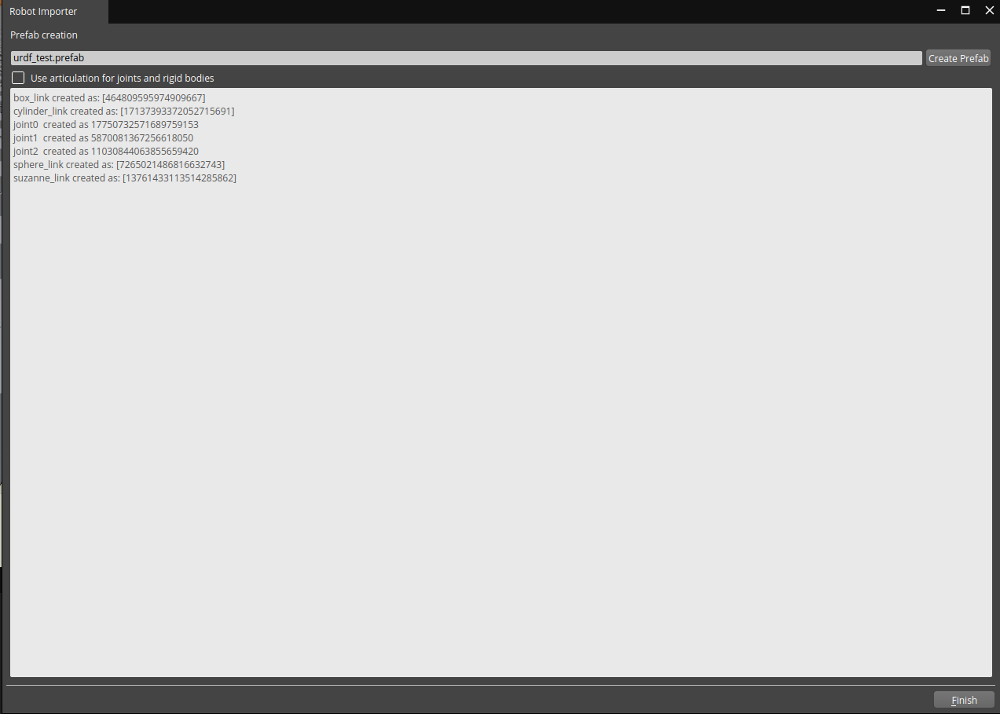
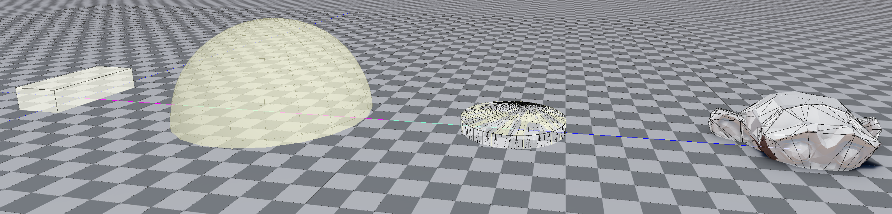
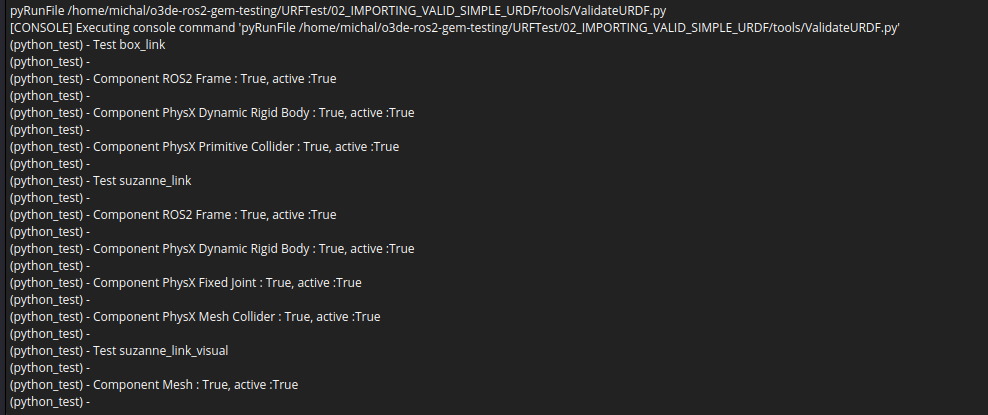

# Test Goal

 - Check if simple URDF is imported

# Test Perquisite

 - Empty default Level
 - ROS2 Gem Activated
 - O3DE Editor running

# Steps

## Step 1 

Open URDF importer

### Expected result 

Windows appears



### **Actual RESULT:**

```

```

## Step 2

- Click next, choose file with "..." button.
- Navigate to attached `data` directory
- Pick `chain.urdf`
- Click `OK` 
- Click `Next`

### Expected result 
Wizard Page validate, next page was loaded.



### **Actual RESULT:**
```

```

## Step 3
Validate is assets are processed correctly

### Expected result 
All assets were processed.



### **Actual RESULT:**

```

```
## Step 4
Create prefab

### Expected result 
The prefab is created and reported:



### **Actual RESULT:**

```

```

## Step 5

Veritfy if:
- all shapes are created
- Suzanne monkey has collider

**please make sure that "Show Helpers for all Entities" is chosen**
### Expected result 
all shapes are drown, monkey has visible mesh and collider.


### **Actual RESULT:**

```

```

## Step 6 

Run verification script
```
pyRunFile /home/michal/o3de-ros2-gem-testing/URFTest/02_IMPORTING_VALID_SIMPLE_URDF/tools/ValidateURDF.py
```
### Expected result 
Script succeed:



### **Actual RESULT:**

```

```