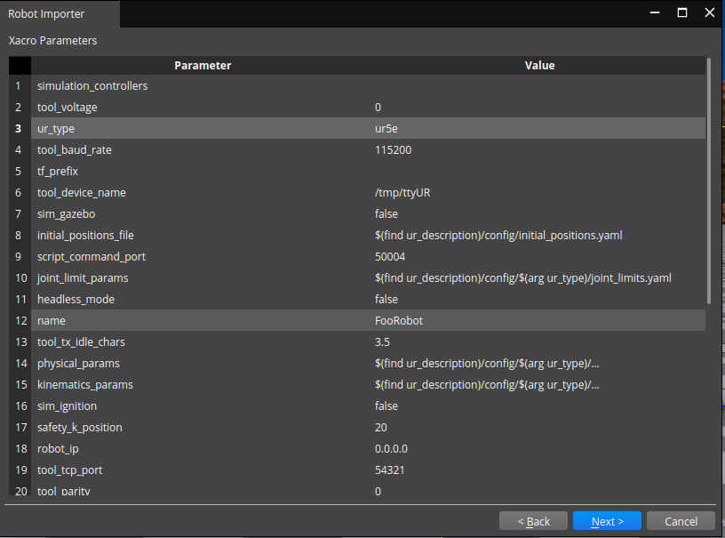

# Test Goal

 - Check if in the wild URDF imports

# Test Perquisite

 - Empty default Level
 - ROS2 Gem Activated
 - O3DE Editor running
 - colcon build, git

 Prepare, build ad source workspace

```
mkdir -p testing_ws/src && cd testing_ws/src && \
git clone https://github.com/UniversalRobots/Universal_Robots_ROS2_Description.git && \
cd Universal_Robots_ROS2_Description && git checkout 464864acfe85f600c3d3438e025805b5296f5aa8 && \
cd ../.. && colcon build && source install/setup.sh
```
**Do not forget to source your test workspace**
# Steps

## Step 1 

Open URDF importer

### Expected result 

Windows appears

### **Actual RESULT:**

```

```

## Step 2 

Click "..." and navigate to `testing_ws/src/Universal_Robots_ROS2_Description/urdf/ur.urdf.xacro`, click Next.

### Expected result 

Step validates.

### **Actual RESULT:**
```

```
## Step 3

Set parameter "name" to "FooRobot" and "type" to "ur5e"
### Expected result 
Step validates, the parameters are shown, can be entered.




### **Actual RESULT:**
```

```

## Step4

Load assets. Wait for all ticks green.
### Expected result 
Step validates, all assets generated with success.


### **Actual RESULT:**
```

```
## Step5
Create prefab

### Expected result 
Step validates, all prefab creation is success.


### **Actual RESULT:**
```

```
## Step6
Take a look on robot.


### Expected result 
Meshes and collider should be loaded.
**It suffers from some graphics asset incompatibility"


### **Actual RESULT:**
```

```