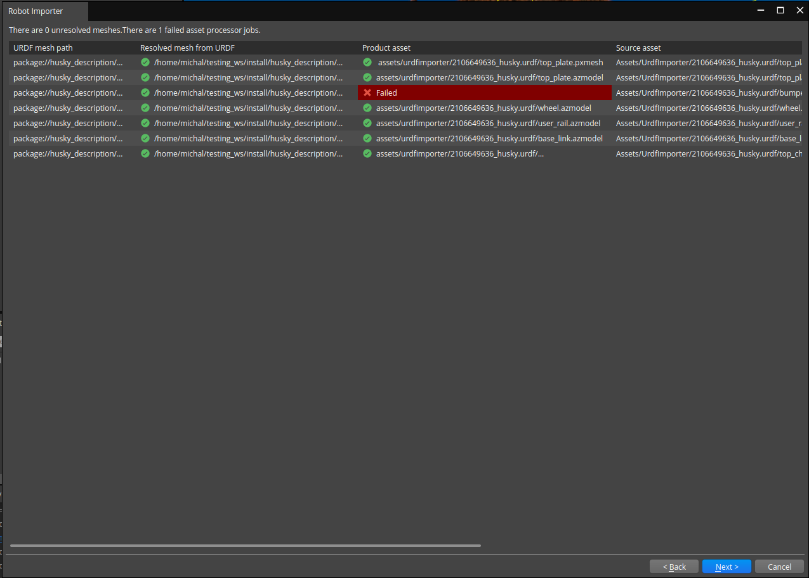
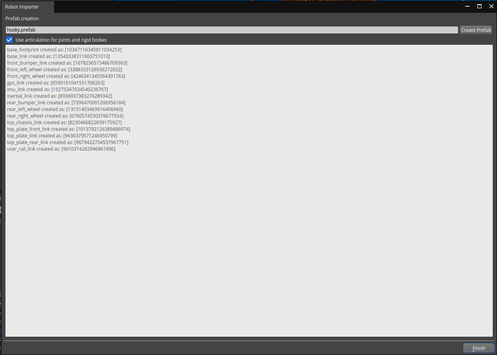
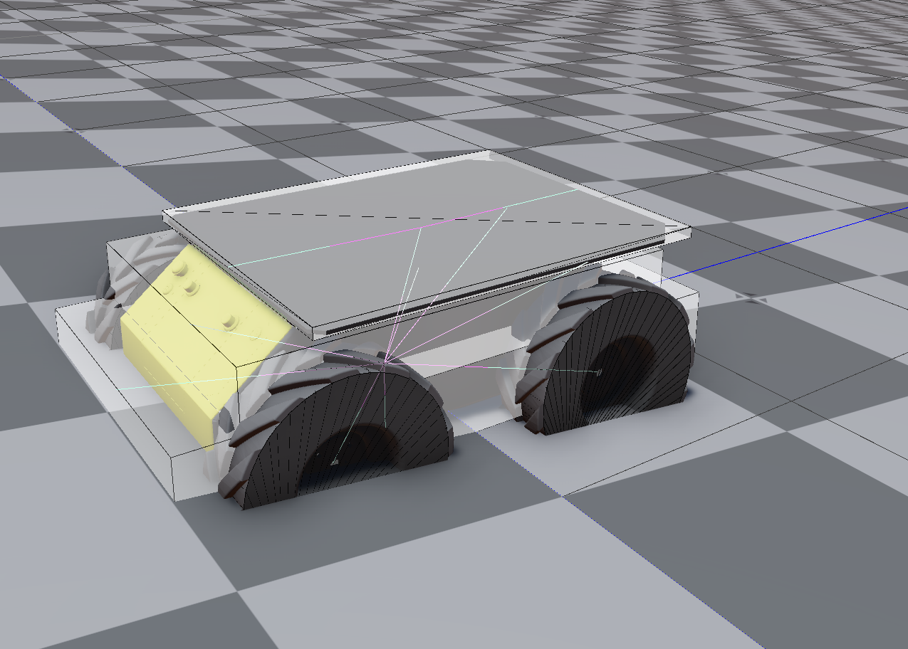

# Test Goal

 - Check if in the wild URDF (Clearpath Husky) imports

# Test Perquisite

 - Empty default Level
 - ROS2 Gem Activated
 - O3DE Editor running
 - colcon build, git

 Prepare, build ad source workspace

```
mkdir -p testing_ws/src && cd testing_ws/src && \
git clone https://github.com/husky/husky.git && \
cd husky && git checkout 1e0b1d14d657f04ec3a86e73d6676a2cf7af6f79  && \
cd ../.. && colcon build && source install/setup.sh
```
**Do not forget to source your test workspace**
# Steps

## Step 1 

Open URDF importer

### Expected result 

Windows appears

### **Actual RESULT:**

```

```

## Step 2 

Click "..." and navigate to `testing_ws/src/husky/husky_description/urdf/husky.urdf.xacro`, click Next.

### Expected result 

Step validates.

### **Actual RESULT:**
```

```
## Step 3

Change nothing in `Xacro parameters`
### Expected result 
Step validates, the parameters are shown.


### **Actual RESULT:**
```

```

## Step4

Load assets. Wait for all ticks. One product asset is expected to fail.

### Expected result 
Step validates, all assets (except `bumper.dae`) generated with success.



### **Actual RESULT:**
```

```
## Step5
Create prefab, tick `User articulation for joints and rigid bodies`

### Expected result 
Step validates, all prefab creation is success.




### **Actual RESULT:**
```

```
## Step6
Take a look on robot, slight rotate `Ground` entity around `Y` axis (about 10 deg).
Start simulation with CNTRL+G.


### Expected result 
- Robot load correctly,
- After start simulation is start moving.




### **Actual RESULT:**
```

```
