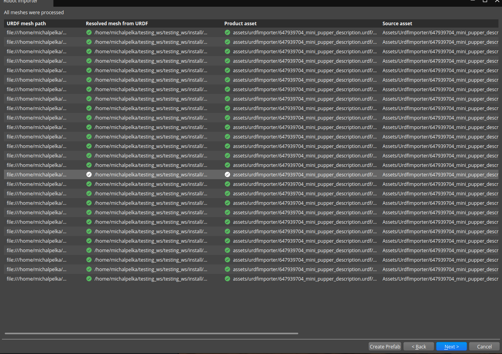
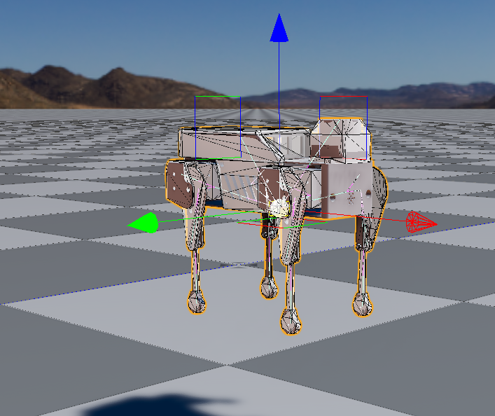

# Test Goal

 - Check if in the wild URDF (MiniPupper)) imports

# Test Perquisite

 - Empty default Level
 - ROS2 Gem Activated
 - O3DE Editor running
 - colcon build, git

 Prepare, build ad source workspace

```
mkdir -p testing_ws/src && cd testing_ws/src && \
git clone https://github.com/mangdangroboticsclub/mini_pupper_ros.git && \
cd mini_pupper_ros && git checkout 276875c09f3423cf307a2b0d0320944e41612712 && \
cd ../.. && colcon build && source install/setup.sh
```
**Do not forget to source your test workspace**
# Steps

## Step 1 

Open URDF importer

### Expected result 

Windows appears

### **Actual RESULT:**

```

```

## Step 2 

Click "..." and navigate to `testing_ws/src/mini_pupper_ros/mini_pupper_description/urdf/mini_pupper_description.urdf.xacro`, click Next.

### Expected result 

Step validates, it currently takes about three minute

### **Actual RESULT:**
```

```

## Step3

Load assets. Wait for all ticks (takes a while).

### Expected result 
Step validates, all assets generated with success.



### **Actual RESULT:**
```

```
## Step4
Create prefab, tick `User articulation for joints and rigid bodies`

### Expected result 
Step validates, all prefab creation is success.



