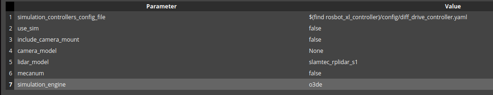
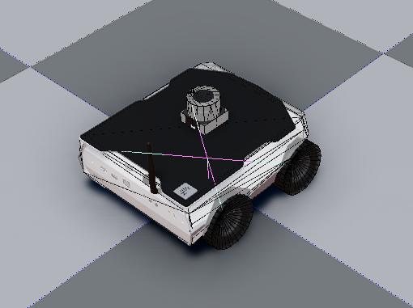

# Test Goal

 - Check if in the wild URDF (Husarion XL) imports

# Test Perquisite

 - Empty default Level
 - ROS2 Gem Activated
 - O3DE Editor running
 - colcon build, git

 Prepare, build ad source workspace

```
mkdir -p testing_ws/src && cd testing_ws/src && \
git clone https://github.com/husarion/rosbot_xl_ros.git && cd rosbot_xl_ros && git checkout 94795ff30585b2b6faa595cd6519a8f9ca17f5d0 && cd .. && \
git clone https://github.com/husarion/ros_components_description.git && cd ros_components_description && git checkout 5f94c332c866c8e39f6854f77d98651a2a3ae226 && cd .. && \
cd .. && colcon build && source install/setup.sh
```
**Do not forget to source your test workspace**
# Steps

## Step 1 

Open URDF importer

### Expected result 

Windows appears

### **Actual RESULT:**

```

```

## Step 2 

Click "..." and navigate to `testing_ws/src/rosbot_xl_ros/rosbot_xl_description/urdf/rosbot_xl.urdf.xacro`, click Next.

### Expected result 

Step validates.

### **Actual RESULT:**

```

```

## Step3

Set parameter "simulation engine" to "o3de"

### Expected result 

Step validates.

## Step4

Load assets. Wait for all ticks (takes a while).

### Expected result 
Step validates, all assets generated with success.



### **Actual RESULT:**
```

```
## Step5
Create prefab, tick `User articulation for joints and rigid bodies`

### Expected result 
Step validates, all prefab creation is success.



