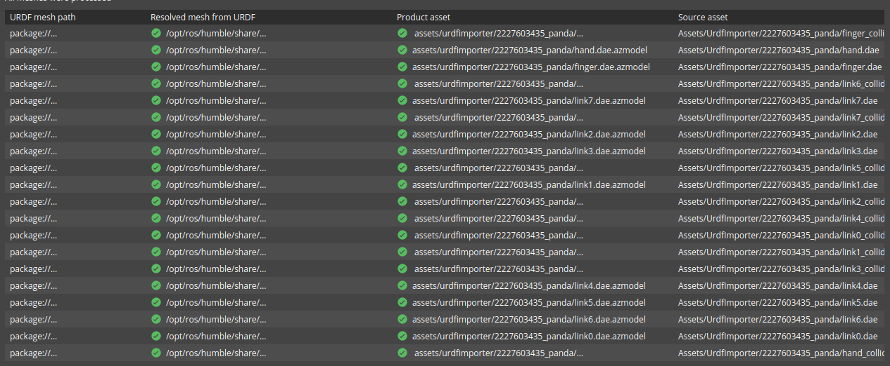
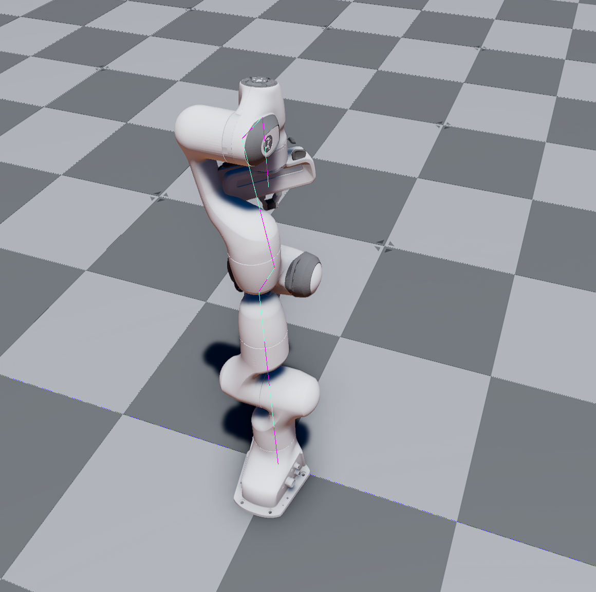

# Test Goal

 - Check in the wild if URDF (PANDA FRANKA) imports

# Test Perquisite

 - Empty default Level
 - ROS2 Gem Activated
 - O3DE Editor running
 - colcon build, git

 Prepare, build and source workspace

```
sudo apt-get install
```
**Do not forget to source your test workspace**
# Steps

## Step 1 

Open URDF importer

### Expected result 

Windows appears

### **Actual RESULT:**

```

```

## Step 2 

Click "..." and navigate to `/opt/ros/humble/share/moveit_resources_panda_description/urdf/panda.urdf`, click Next.

### Expected result 

Step validates.

### **Actual RESULT:**

```

```

## Step3

Load assets. Wait for all ticks (takes a while).

### Expected result 
Step validates, all assets generated with success.



### **Actual RESULT:**
```

```
## Step5
Create prefab, tick `User articulation for joints and rigid bodies`

### Expected result 
Step validates, all prefab creation is success.



### Note
In test `ros-humble-moveit-resources` in vesrion `2.0.6-1.jammy.2023` was used.