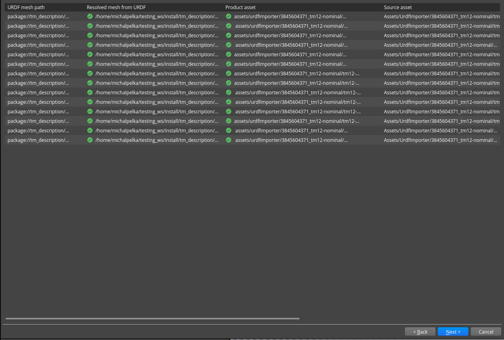
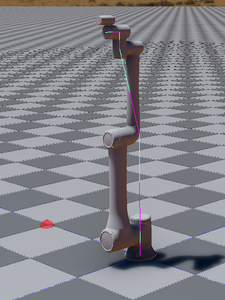

# Test Goal

 - Check in the wild if URDF (TM14S) imports

# Test Perquisite

 - Empty default Level
 - ROS2 Gem Activated
 - O3DE Editor running
 - colcon build, git

 Prepare, build and source workspace

```
mkdir -p testing_ws/src && cd testing_ws/src && \
git clone https://github.com/TechmanRobotInc/tmr_ros2.git && \
cd tmr_ros2 && git checkout 13cf3b96746d750750312f0492a021a02d1ec34f && cd .. && \
touch tmr_ros2/custom_package/COLCON_IGNORE &&\
touch tmr_ros2/demo/COLCON_IGNORE &&\ 
touch tmr_ros2/tm_driver/COLCON_IGNORE &&\
cd .. && colcon build && source install/setup.sh
```
# Steps

## Step 1 

Open URDF importer

### Expected result 

Windows appears

### **Actual RESULT:**

```

```

## Step 2 

Click "..." and navigate to `testing_ws/src/tmr_ros2/tm_description/urdf/tm12-nominal.urdf`, click Next.

### Expected result 

Step validates, it currently takes about three minute

### **Actual RESULT:**
```

```

## Step3

Load assets. Wait for all ticks.

### Expected result 
Step validates, all assets generated with success.



### **Actual RESULT:**
```

```
## Step4
Create prefab, tick `User articulation for joints and rigid bodies`

### Expected result 
Step validates, all prefab creation is success.



