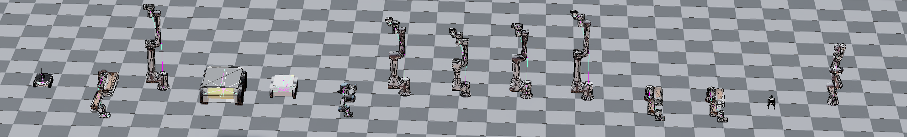

# Test Goal

 - Check if in the wild URDF (TM14S) imports

# Test Perquisite

 - Empty default Level
 - ROS2 Gem Activated
 - O3DE Editor running
 - colcon build, git

 Prepare, build ad source workspace:

```bash
./data/create_ws.sh
```
Export `xacros` to `urdfs`
```bash
./data/create_urdfs.sh
```
**Do not forget to source your test workspace**

**Do not forget to clean old imports. Remove `Assets/UrdfImporter/` from your o3de project**


# Steps

## Step 1 

Open empty level, to console and execute test script:

```
pyRunFile <global_path-o3de-ros2-gem-testing>/URDFTest/99_IMPORTING_URDF_MULTIIMPORT/data/import.py
```
Replace `<global_path-o3de-ros2-gem-testing>` with global path to `o3de-ros2-gem-testing`

## Validation

Robots should start appearing, it takes a quite long time.
